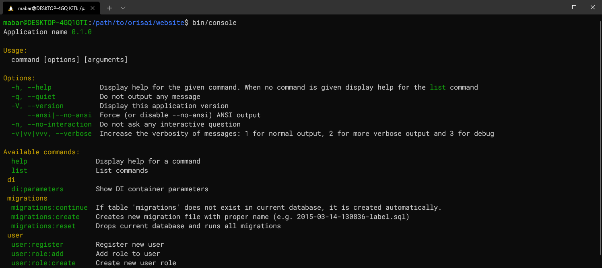

<h1 align="center">Orisai Nette Console</h1>

    <a href="https://symfony.com/doc/current/components/console.html">symfony/console</a> integration for <a href="https://nette.org">Nette</a>

  
  
  
  
  
  

## Documentation

For details on how to use this package, check out our [documentation](docs/README.md).

Please take a note knowledge of PHP, Composer and other tools used is expected and not explained by package docs.

## Versions

| State  | Version      | PHP     |
|--------|--------------|---------|
| dev    | `1.x-dev`    | `>=7.4` |
| stable | `^1.0.0`     | `>=7.4` |
