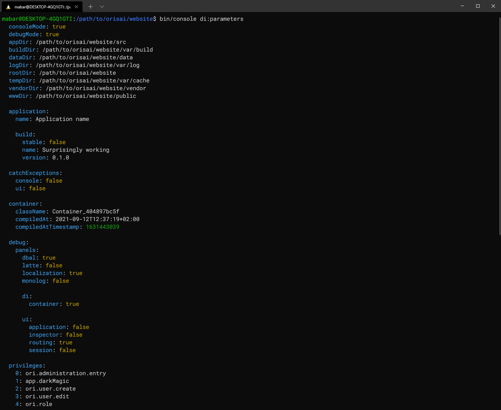

# Nette Console

[symfony/console](https://symfony.com/doc/current/components/console.html) integration for [Nette](https://nette.org)


## Content

- [Setup](#setup)
	- [Entrypoint](#entrypoint)
	- [Debug mode](#debug-mode)
- [Console configuration](#console-configuration)
- [Lazy loading](#lazy-loading)
- [HTTP - link generating](#http---link-generating)
- [Overwriting command configuration](#overwriting-command-configuration)
- [Writing own commands](#writing-own-commands)
	- [PHPStan compatibility](#phpstan-compatibility)
- [Extra commands](#extra-commands)
	- [di:parameters](#diparameters)
- [Helpers and helper set](#helpers-and-helper-set)
- [Events](#events)

## Setup

Install with [Composer](https://getcomposer.org)

```sh
composer require orisai/nette-console
```

Register extension

```neon
extensions:
	console: OriNette\Console\DI\ConsoleExtension
```

### Entrypoint

Create an entrypoint for console

It's a script similar to `www/index.php`, it just gets `Symfony\Component\Console\Application` from DI container and
runs it.

Create a file called `bin/console` and make sure it is executable - `mkdir bin/console && chmod +x bin/console`. After
that just copy and paste one of following snippets into the file.

For Nette 3.0+ [web-project](https://github.com/nette/web-project) structure, it should look like this:

```php
#!/usr/bin/env php
<?php declare(strict_types = 1);

use App\Bootstrap;
use Symfony\Component\Console\Application;

require __DIR__ . '/../vendor/autoload.php';

$configurator = Bootstrap::boot();
$container = $configurator->createContainer();
$application = $container->getByType(Application::class);
exit($application->run());
```

For structure of Nette <=2.4:

```php
#!/usr/bin/env php
<?php declare(strict_types = 1);

use Nette\DI\Container;
use Symfony\Component\Console\Application;

$container = require __DIR__ . '/../app/bootstrap.php';
$application = $container->getByType(Application::class);
exit($application->run());
```

Now you should be able to run console via `php bin/console`. In most of the environments should also work `bin/console`.

### Debug mode

To see any changes dependent on debug mode, like adding new commands to config, you have to enable debug mode as it's
not enabled by default.

With [nette/bootstrap](https://github.com/nette/bootstrap) configurator it may look like this:

```php
// Enable debug mode in console and on (http) localhost
$configurator->setDebugMode(
	PHP_SAPI === 'cli'
	|| $configurator::detectDebugMode()
);
```

With [orisai/nette-di](https://github.com/orisai/nette-di) configurator:

```php
use OriNette\DI\Boot\Environment;

// Enable debug mode in console and on (http) localhost
$configurator->setDebugMode(
	Environment::isConsole()
	|| Environment::isLocalhost()
);
```

## Console configuration

Optionally set `name` and `version`, they will be shown on top of `bin/console` (alias for `bin/console list`) command.

```neon
console:

	# string|null
	# Default: null
	name: Application name

	# string|null
	# Default: null
	version: '0.1.0'
```

Usually **symfony/console** catches all exceptions and renders them nicely instead of letting them being handled by
error handler. We have that option *disabled* in presumption you use [Tracy](https://tracy.nette.org/en/) already.
Benefit is that Tracy is able not only to render exception in console but also to log it. However, you may still opt-in
to enable error catching built in **symfony/console**.

```neon
console:

	# bool
	# Default: false
	catchExceptions: false
```

All commands registered as services are added to console, you don't have to add them.

## Lazy loading

Console offers lazy loading of commands with which they are loaded just when used. Without lazy loading commands are
always instantiated to get its name and description.

To enable lazy loading each command has to define **name** and **description** either as
a [property/method in its definition](#writing-own-commands)
or [in DI service configuration](#overwriting-command-configuration).

No global config option is required, our integration is able to load both lazy and not lazy commands.

To debug lazy loading, run `bin/console commands-debug`. It will show you which commands are missing name or
description.

## HTTP - link generating

It's possible to work with http request in console. Main reason to do so is link generating. To generate a link you have
to enable http request override and specify base URL.

Enable override:

```neon
console:
	http:
		override: %consoleMode%
```

Specify URL either via configuration:

```neon
console:
	http:
		url: https://www.example.com
```

Or via command option:

```sh
bin/console newsletter:send --ori-url https://example.com
```

All the commands have this global option available, and it precedes URL from configuration in priority.

Be aware request is created just once per PHP run, argument `ori-url` cannot be changed without recreating DIC object.
To call other commands from your command with different url you have to do so via separate PHP process (
run `bin/console`).

Also, only *argv* input is used because we need to know value of argument before a command is run. In practice, it means
to set this option in tests you have to set it directly to `$_SERVER['argv']`, no other variant will work (e.g.
via `new ArrayInput()`). `bin/console` uses *argv* as input, therefore standard usage is not affected.

## Overwriting command configuration

It's possible to override command configuration via service tag `console.command` - change name and aliases, set
description and hide the command from command list. To do so, add tag to command service.

Change *name* and *description*:

```neon
services:
	overriden.command:
		tags:
			console.command:
				name: new-name
				description: New description
```

*Aliases* are added to name, separated by `|`:

```neon
services:
	overriden.command:
		tags:
			console.command:
				name: AgathaChristie|MaryWestmacott|AgathaMaryClarissaMiller
				description: Woman of many names.
```

To *hide* command, add leading `|` to name:

```neon
services:
	overriden.command:
		tags:
			console.command:
				name: |unicorn
				description: "I am hiding so people can't hang my head on their wall."
```

Don't set command name, description, aliases or hidden via constructor or `set*()` methods (`setName()`, ...). It's not
supported by lazy loading and configuration via tags and default properties/methods will always be prioritized.

Note: Syntax of aliases and hidden command matches the one from Symfony.

## Writing own commands

Following example shows how to define command that is findable by `ConsoleExtension` and is lazy loaded.

To learn about accepting input arguments and options, writing to output and else about commands,
check [Symfony documentation](https://symfony.com/doc/current/components/console.html).

```php
namespace App\Core\Newsletter;

use Symfony\Component\Console\Command\Command;
use Symfony\Component\Console\Input\InputInterface;
use Symfony\Component\Console\Output\OutputInterface;

final class SendNewsletterCommand extends Command
{

	private NewsletterSender $newsletterSender;

	public function __construct(NewsletterSender $newsletterSender)
	{
		parent::__construct();
		$this->newsletterSender = $newsletterSender;
	}

	public static function getDefaultName(): string
	{
		return 'newsletter:send';
	}

	public static function getDefaultDescription(): ?string
	{
		return 'Send newsletter to users';
	}

	protected function execute(InputInterface $input, OutputInterface $output): int
	{
		$this->newsletterSender->send();

		return self::SUCCESS;
	}

}
```

Register command as a service:

```neon
services:
	- App\Core\Newsletter\SendNewsletterCommand
```

### PHPStan compatibility

[PHPStan](https://phpstan.org) does not understand commands arguments and options out of the box. To solve that problem,
you can set up [phpstan/phpstan-symfony](https://github.com/phpstan/phpstan-symfony).

Just install the package, register rules (if you don't
use [phpstan/extension-installer](https://github.com/phpstan/extension-installer)) and prepare a script which will
provide `Symfony\Component\Console\Application` to PHPStan.

Create file `phpstan-console.php`:

```php
<?php declare(strict_types = 1);

use App\Bootstrap;
use Symfony\Component\Console\Application;

require __DIR__ . '/../vendor/autoload.php';

$configurator = Bootstrap::boot();
$configurator->setDebugMode(true);
$container = $configurator->createContainer();

return $container->getByType(Application::class);
```

Link file `phpstan-console.php` in `phpstan.neon`:

```neon
parameters:
	symfony:
		console_application_loader: phpstan-console.php
```

## Extra commands

This package provides some extra commands specific for nette/di.

### di:parameters

`bin/console di:parameters`

Dump parameters into console, sorted and highlighted.



If you do not have parameters export to DIC enabled (Option `export > parameters` of `Nette\DI\Extensions\DIExtension`
is set to `false`), command will be not able to dump parameters. To bypass that limitation, enable backup of parameters
just for scope of `di:parameters` command:

```neon
console:
	di:
		parameters:
			# true|false
			# Default: false
			backup: %consoleMode%
```

## Helpers and helper set

While you can still use [default helpers](https://symfony.com/doc/current/components/console/helpers/index.html) and
register new helpers via `$application->getHelperSet()->set(new ExampleHelper())` we don't provide any support for
registering helpers in configuration. It's just not needed. Dependencies should be requested via constructor and
rendering helpers can always be created via `new ExampleHelper()`.

## Events

**symfony/event-dispatcher** (and also **symfony/event-dispatcher-contracts**) is integrated into console
via `Symfony\Component\Console\ConsoleEvents`. Our extension autoconfigures that integration, so you can use these
events.
